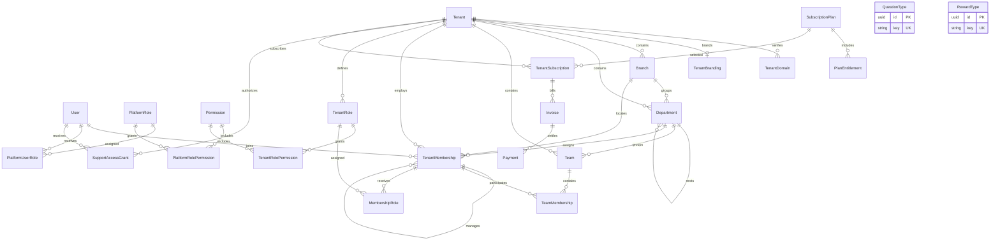
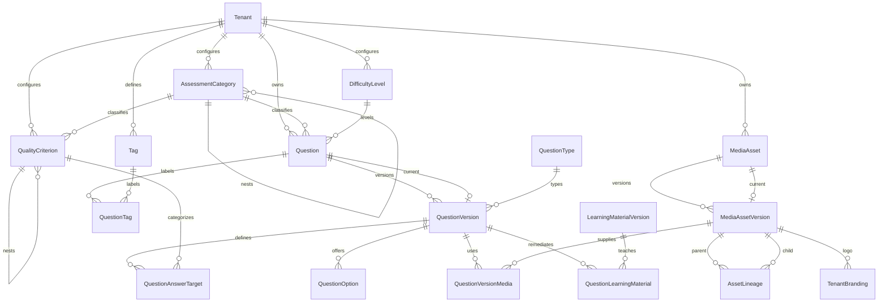
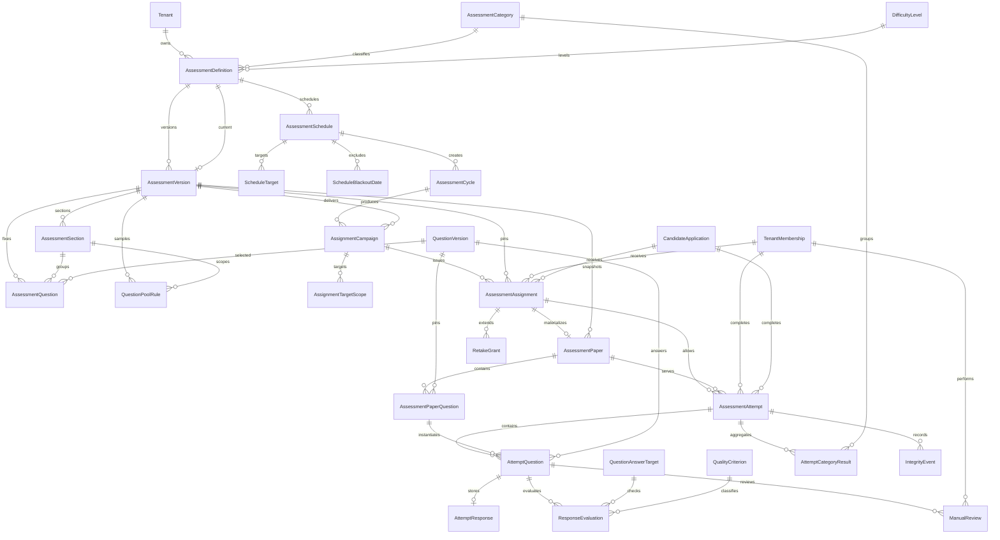
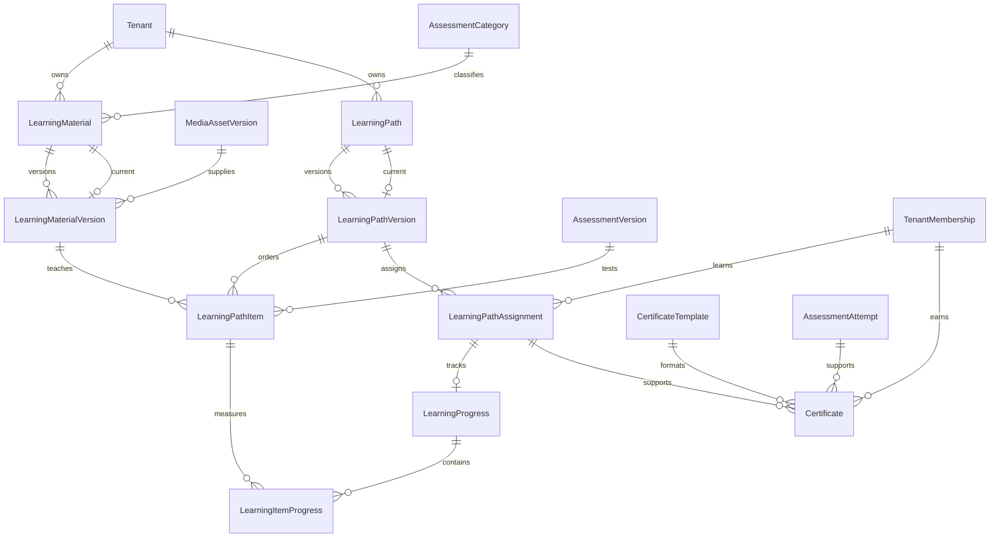
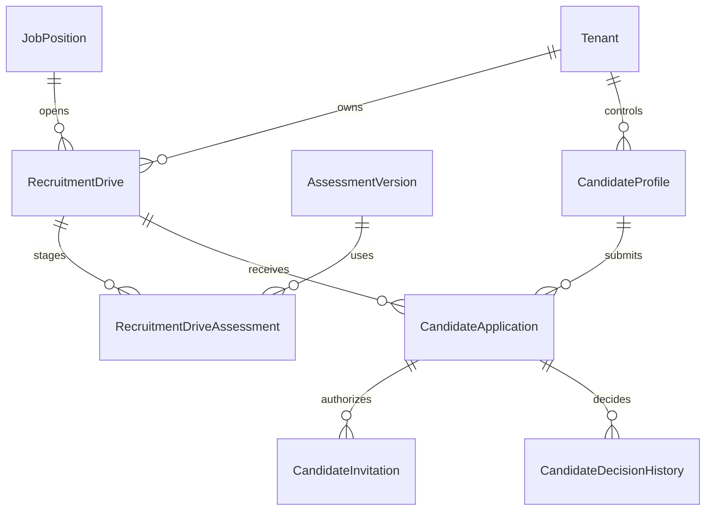
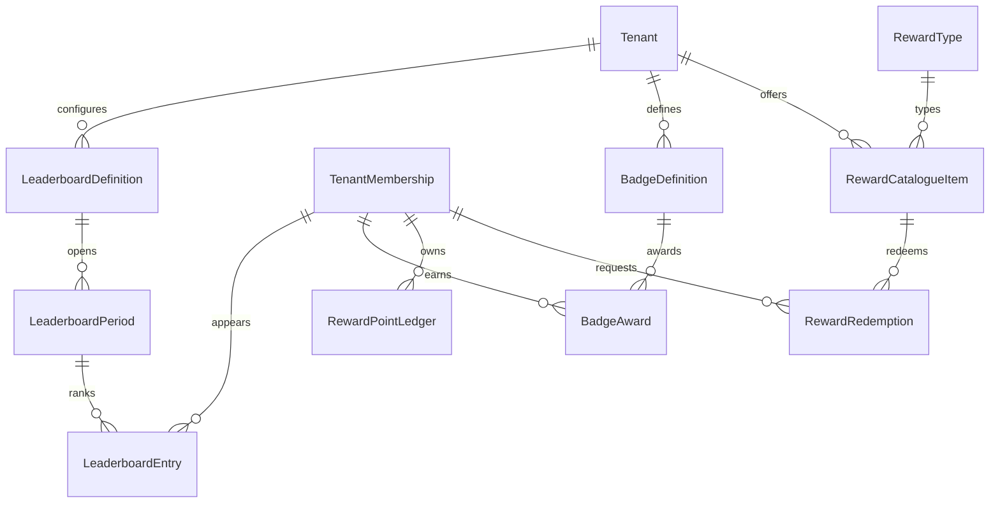
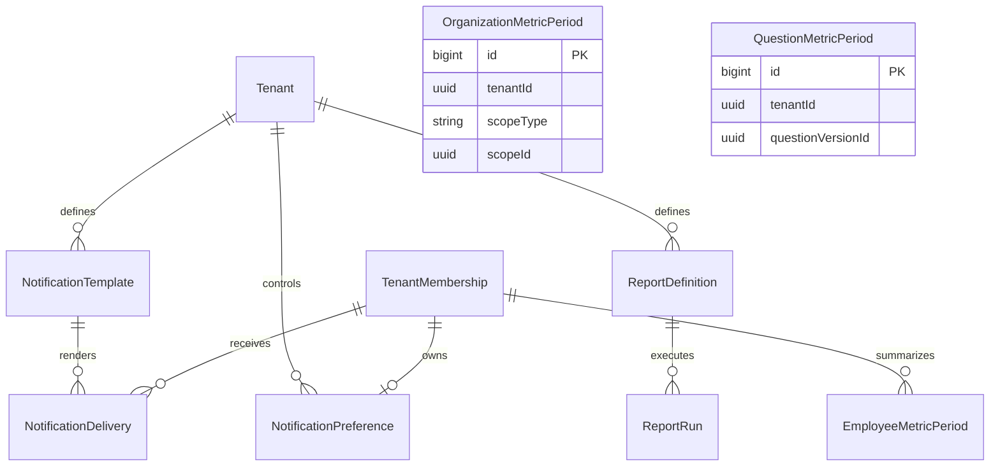
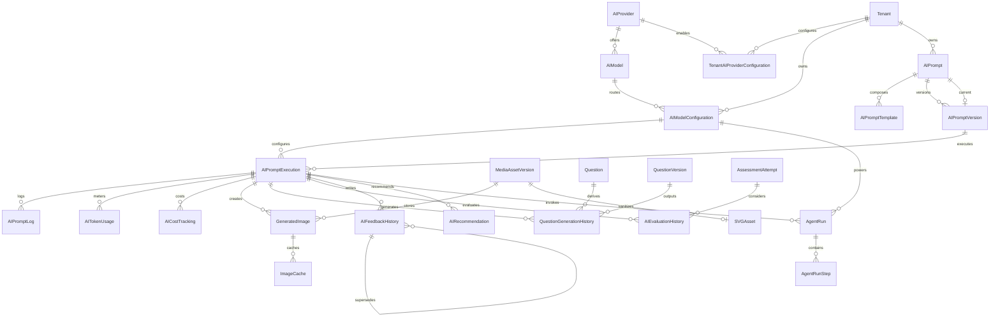
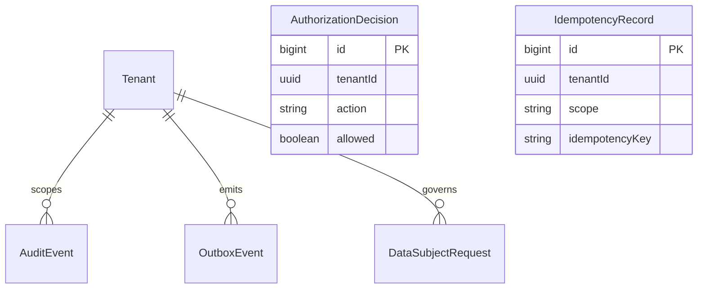

# Zorfly Entity-Relationship Diagrams

## Reading the diagrams

The physical model is split into PostgreSQL schemas matching modular-monolith
ownership. Diagrams show logical cardinality; `schema.prisma` is authoritative
for columns, optionality, indexes, and referential actions. `tenantId` exists on
every tenant-owned entity even where it is omitted from the visual.

Polymorphic scope/source references are intentionally shown as values rather
than direct lines. Their allowed combinations and tenant checks are enforced by
custom migration constraints described in `MIGRATION_STRATEGY.md`.

## Platform, tenants, organization, RBAC, and billing

## Taxonomy, questions, and media

## Assessment authoring, scheduling, delivery, scoring, and review

## Learning and certification

## Recruitment

## Engagement and rewards

## Notifications, reports, and analytics projections

## AI, image, SVG, and agent control plane

## Operations, authorization, governance, and messaging

