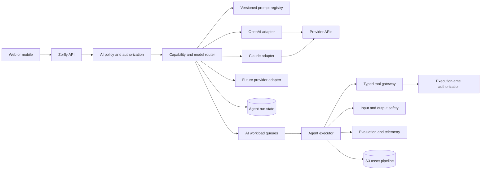

# AI and Agent Architecture

## Status

This document defines readiness boundaries for future AI capabilities. It does
not select a product feature, prompt, text model, embedding model, or autonomous
workflow.

## Principles

- AI output is untrusted, probabilistic input to deterministic application code.
- The model never becomes an authorization boundary.
- Provider APIs are adapters behind Zorfly-owned contracts.
- Tenant data, prompts, tools, memory, spend, and telemetry remain isolated.
- Every production capability has evaluations, safety controls, observability,
  budgets, and a kill switch.
- Human approval is required for consequential, destructive, external,
  irreversible, or high-cost actions.
- Model aliases and snapshots are configuration governed by evaluation, not
  scattered source constants.

## Logical architecture



## AI control plane

The control plane owns:

- provider and model capability registry;
- approved model snapshots and rollout percentages;
- prompt templates, versions, owners, and evaluation results;
- tenant entitlements, regional restrictions, budgets, and concurrency;
- safety, content, retention, and human-approval policies;
- tool registry and schemas;
- evaluation datasets and release gates;
- provider health, circuit breakers, and routing policy;
- emergency disable switches by tenant, capability, provider, and model.

The data plane executes individual inference and agent runs using an immutable
snapshot of approved configuration.

## Provider-neutral contracts

`packages/ai-core` will define application-owned concepts:

- `AiCapability`, not provider model names;
- normalized input parts for text, images, files, and structured data;
- requested output schema and media constraints;
- tenant, actor, classification, region, latency, quality, and cost policy;
- tool declarations using JSON Schema;
- usage, latency, provider request ID, finish reason, safety result, and cost
  envelope;
- opaque provider continuation state;
- normalized retryability and error categories.

Provider-specific SDK types never cross the adapter boundary. Do not force every
provider feature into a lowest-common-denominator contract; expose optional,
capability-checked extensions behind explicit feature flags.

## Model routing

Route by capability and policy, considering:

- required modalities and tools;
- structured-output reliability;
- evaluation score for the exact workflow;
- latency and availability target;
- tenant region and data-processing policy;
- model lifecycle and deprecation;
- context and output limits;
- current rate-limit headroom;
- estimated and actual cost.

Fallback is allowed only when the fallback passes the same safety, residency,
contract, and quality gates. Never silently route regulated data to a provider
that lacks approval.

## OpenAI integration

### General and agent workflows

- Prefer the Responses API for new multi-turn, tool-using OpenAI workflows.
- Keep provider response IDs and continuation state opaque inside the adapter.
- Verify webhook signatures, acknowledge quickly, and retrieve canonical state
  where required.
- Send a stable privacy-preserving safety identifier for end-user requests when
  supported and appropriate.
- Treat built-in and remote tools as separately risk-assessed integrations.
- Do not depend on beta multi-agent capability for core correctness or
  availability; Zorfly owns durable orchestration and may opt into provider
  orchestration only behind evaluation and fallback.

### Image generation and editing

OpenAI currently documents two paths:

- Use the Image API for a single generation or edit from one request.
- Use the Responses API image-generation tool for conversational or multi-turn
  editing.

The current image model is represented in the provider registry by capability;
the adapter may configure an approved GPT Image snapshot. Never embed a moving
model alias in domain records without also persisting the resolved model and
provider request metadata.

Image requests execute on dedicated asynchronous queues when they exceed the
interactive latency budget. The pipeline records:

- tenant, actor, capability, policy, prompt-template, and model versions;
- source asset hashes and provenance;
- requested size, quality, format, background, and edit parameters;
- provider request ID, usage, latency, and normalized cost;
- safety decisions and review state;
- output hash, media metadata, storage location, and lineage.

Generated files enter a private quarantine prefix, are decoded and validated,
scanned, stripped of unnecessary metadata, assigned content-derived hashes, and
then promoted to an immutable asset prefix. Clients receive short-lived signed
URLs, never provider credentials or raw provider URLs.

## Claude integration

The Claude adapter owns the Messages API contract and Anthropic-specific content
blocks, stop reasons, request IDs, and continuation state.

- Client tools are declared with explicit JSON schemas.
- Claude `tool_use` blocks are requests, not executed authority.
- The Zorfly tool gateway validates arguments, re-authorizes, executes, and
  returns bounded `tool_result` content.
- Tool loops have maximum iterations, elapsed time, tokens, cost, repeated-call,
  and failure limits.
- Independent safe reads may run concurrently; side effects are serialized when
  ordering or approval matters.
- Prompt caching is used for stable system and tool prefixes only after measuring
  cache behavior and data-policy compatibility.
- Message Batches are used only for non-interactive work that tolerates delayed
  and unordered completion; `custom_id` maps results to internal jobs.
- Provider overload and rate-limit errors use bounded retry with jitter and
  queue-based backpressure.

Provider-specific prompt techniques remain within the adapter's prompt variant
and evaluation suite. A single prompt is not assumed to behave identically
across providers.

## Durable agent runs

An agent run is a persisted state machine, not an in-memory loop:

```text
requested -> policy_checked -> queued -> running
          -> waiting_for_tool
          -> waiting_for_approval
          -> completed | failed | canceled | expired
```

Every transition is idempotent, version-checked, and audited. The run stores:

- tenant, initiating principal, delegated authority, and expiry;
- goal and immutable configuration snapshot;
- provider and model routing decisions;
- prompt and tool versions;
- bounded conversation and provider continuation references;
- step, token, time, cost, and retry budgets;
- tool calls, approvals, results, and side-effect receipts;
- safety outcomes and final artifact lineage.

Workers use leases and heartbeats. A lease expiry may resume a run, so tools with
side effects require idempotency keys and receipts.

## Tool security

- Tools use narrow verbs and schemas, not general shell, SQL, HTTP, or code
  execution by default.
- The executor derives tenant and actor context outside model-controlled
  arguments.
- Read and write tools are distinct.
- Tool outputs are size-bounded, classified, sanitized, and treated as untrusted
  content that may contain prompt injection.
- External fetches use egress allowlists, SSRF protection, content limits, and
  malware scanning.
- Secrets are injected only at the executor and never returned to the model.
- Consequential tools require preview, human approval, and commit phases.
- Approval binds the exact normalized action and expires; later mutation requires
  new approval.

## Retrieval and memory

No vector database is selected until a retrieval use case and data policy are
approved.

When introduced:

- source documents retain tenant, ACL, classification, region, version, and
  deletion metadata;
- authorization filters apply before retrieval and again before returning
  content;
- chunks preserve citation and provenance;
- embeddings are treated as derived customer data;
- deletion propagates to chunks, indexes, caches, evaluations, and backups under
  defined retention;
- conversation memory is explicit, scoped, inspectable, editable, and
  tenant-isolated;
- model-generated summaries never replace authoritative records.

## Safety and governance

Threat models cover prompt injection, data exfiltration, tool abuse, indirect
instructions, model denial of wallet, unsafe generated media, cross-tenant
memory, poisoning, and insecure output handling.

Controls include:

- input classification and policy checks;
- output schema validation and content safety checks;
- user reporting and review workflow;
- rate, concurrency, token, image, and spend budgets per tenant and capability;
- red-team suites and deterministic regression evaluations;
- staged rollout with shadow, canary, and rollback;
- vendor data-retention and regional-processing configuration;
- legal review for training, copyright, likeness, and generated-media use cases.

## Caching

- Provider prompt caching is an optimization, not application state.
- Cache only stable prefixes permitted by the data policy.
- Record cache read/write token usage and cost.
- Exact-result caching is allowed only for deterministic, non-personal,
  policy-equivalent requests with tenant-safe keys.
- Do not semantically cache authorization, safety, personalized, or
  time-sensitive responses without a specific design review.
- Generated media uses content-addressed deduplication only within authorized
  tenant scope.

## Observability and evaluation

Operational telemetry includes:

- provider, capability, model snapshot, prompt version, and release;
- latency to first token and total latency;
- input, output, cached, image, and tool usage;
- normalized cost and budget rejection;
- queue wait, run duration, tool count, retry, timeout, and cancellation;
- safety blocks, human approvals, and policy denials;
- provider error class and request ID.

Do not log raw prompts, tool results, files, or model outputs by default.

Quality gates measure task success, schema validity, groundedness, citation
quality, tool correctness, refusal behavior, safety, latency, and cost on
representative tenant-safe datasets. A model or prompt change cannot reach
production solely because it is newer.

## Official references

- [OpenAI Responses API](https://developers.openai.com/api/docs/guides/migrate-to-responses)
- [OpenAI image generation](https://developers.openai.com/api/docs/guides/image-generation)
- [OpenAI GPT Image 2](https://developers.openai.com/api/docs/models/gpt-image-2)
- [OpenAI webhooks](https://developers.openai.com/api/docs/guides/webhooks)
- [OpenAI model guidance](https://developers.openai.com/api/docs/guides/latest-model)
- [Claude tool use](https://platform.claude.com/docs/en/agents-and-tools/tool-use/how-tool-use-works)
- [Claude prompt caching](https://platform.claude.com/docs/en/build-with-claude/prompt-caching)
- [Claude Message Batches](https://platform.claude.com/docs/en/api/messages/batches)
- [Claude API errors](https://platform.claude.com/docs/en/api/errors)
