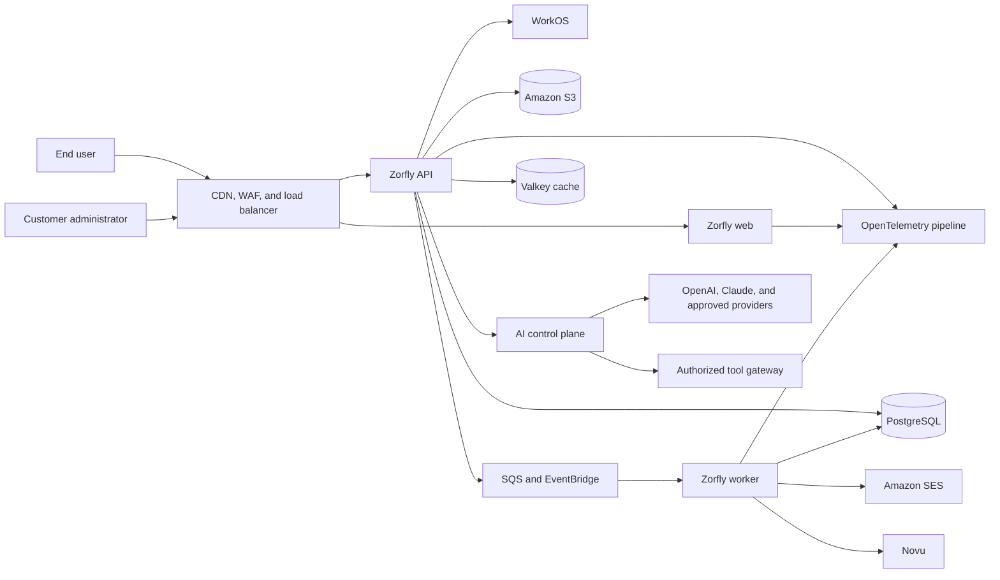

# Zorfly Architecture

## Status

This document defines the initial architecture direction. It is a proposal to be
validated before application implementation.

## Architectural goals

Zorfly must:

1. isolate customer data and operations by tenant;
2. support enterprise identity and lifecycle management;
3. remain reliable under partial dependency failures;
4. produce complete operational and security audit trails;
5. deploy safely without routine downtime;
6. scale services independently when evidence requires it;
7. minimize irreversible decisions during product discovery.
8. support web, mobile, integration, and delegated-agent clients through stable
   contracts;
9. govern probabilistic AI and generated media without making providers part of
   the trust boundary;
10. recover critical service within approved and tested RTO/RPO targets.

## Context

Zorfly is a browser-accessed, multi-tenant SaaS platform. Users belong to one or
more organizations. External identity providers authenticate users; Zorfly owns
application authorization and business data. The platform communicates with
managed email, notification, storage, and asynchronous messaging services.

## Architecture style

### Modular monolith first

The backend starts as a modular monolith with a separate worker process. Modules
own their contracts, persistence access, and domain rules. Cross-module access
occurs through explicit application interfaces or events, never by reaching into
another module's tables or internals.

This approach provides:

- lower delivery and operational complexity than early microservices;
- atomic transactions where the domain genuinely requires them;
- clear extraction seams if a module later needs independent scale, ownership,
  availability, or release cadence;
- one consistent security and observability baseline.

Service extraction requires measurable evidence and an ADR.

### Deployable units

- **Web:** server-rendered frontend and browser assets.
- **API:** stateless synchronous HTTP API.
- **Worker:** asynchronous command and event consumers.
- **Migration job:** one-shot, forward-only database migrations.

All runtime units are immutable containers. Persistent state lives only in
managed data services.

The AI orchestration capability begins as modules in the API and worker. It may
be extracted only when its failure domain, scaling profile, security ownership,
or release cadence requires independent deployment.

## Multi-tenancy

The initial model is shared application and shared PostgreSQL cluster with a
mandatory `tenant_id` on tenant-owned records.

Controls include:

- tenant identity derived from the authenticated organization membership, never
  trusted directly from client input;
- tenant context required in application commands, queries, logs, metrics, and
  audit events;
- composite keys and indexes that include `tenant_id` where appropriate;
- PostgreSQL row-level security as defense in depth for tenant-owned tables;
- transaction-scoped database tenant context;
- automated negative tests proving cross-tenant access is denied;
- per-tenant object-storage prefixes and authorization;
- no tenant-sensitive values in queue names, URLs, logs, or metric labels.

Dedicated database or deployment isolation may be added for regulated customers
behind the same repository and contracts.

Tenant isolation also applies to cache keys, queue admission, AI prompts and
memory, tool execution, generated assets, cost accounting, logs, and support
operations. See [Data and API Architecture](DATA_AND_API_ARCHITECTURE.md) and
[AI and Agent Architecture](AI_AND_AGENT_ARCHITECTURE.md).

## Request and data flow

1. The edge terminates TLS, applies WAF and rate-limiting policies, and forwards
   an immutable request identifier.
2. WorkOS authenticates the user. The API validates token issuer, audience,
   signature, expiry, and organization membership.
3. The authorization layer resolves Zorfly permissions and tenant context.
4. The application layer validates the command or query and invokes a domain
   module.
5. Persistence operations run in an explicit transaction where required.
6. Durable side effects are recorded through a transactional outbox.
7. Workers publish or consume idempotent messages with bounded retries and
   dead-letter queues.
8. Structured telemetry records the result without exposing secrets or sensitive
   customer data.

## API conventions

- Versioned REST/JSON is the initial external contract.
- OpenAPI is the canonical machine-readable API description.
- Inputs and outputs are validated at runtime.
- Errors use RFC 9457 Problem Details.
- Mutation endpoints support idempotency where clients may retry.
- Pagination uses opaque cursors.
- Public contracts are backward compatible within a supported version.
- Rate limits are scoped by tenant, actor, and endpoint risk.

GraphQL or additional protocols require a demonstrated use case and an ADR.

The same public capability contracts serve web, future mobile, integrations, and
agent clients. Product capability must not exist only behind Next.js-specific
actions or browser cookies.

## Asynchronous processing

- Commands that may exceed the request latency budget run asynchronously.
- Messages contain identifiers and minimal metadata, not full sensitive records.
- Consumers are idempotent and tolerate duplicate, delayed, and reordered
  delivery.
- Each queue has explicit retry, visibility-timeout, retention, and dead-letter
  policies.
- The transactional outbox prevents committed database work from losing its
  corresponding message.
- Correlation and causation identifiers connect requests, messages, and audit
  events.
- Per-tenant admission and concurrency controls prevent a hot tenant or AI
  workload from starving critical jobs.

## Caching

Caching is layered across CloudFront, clients, Next.js, and Valkey. Every mutable
entry has an owner, TTL, tenant-safe key, invalidation strategy, and source of
truth. Cache failure must not weaken authorization or correctness. Full rules
are defined in [Data and API Architecture](DATA_AND_API_ARCHITECTURE.md).

## Security architecture

### Identity and access

- WorkOS provides authentication, enterprise SSO, MFA, and directory sync.
- Zorfly enforces authorization at the API and domain boundaries.
- Deny-by-default permissions are attached to organization memberships.
- Privileged operations require explicit permissions and generate audit events.
- Support impersonation, if introduced, must be time-limited, visible,
  attributable, approved, and fully audited.

The formal policy decision and enforcement model, role versioning,
separation-of-duty controls, and delegated agent authority are defined in
[Authorization Architecture](AUTHORIZATION_ARCHITECTURE.md).

### Data protection

- TLS 1.2 or later in transit and AWS-managed encryption at rest.
- Secrets stored in AWS Secrets Manager, never environment files in source
  control.
- Sensitive fields classified before implementation and minimized by default.
- Object access uses short-lived signed URLs and private buckets.
- Backups are encrypted, access-controlled, tested, and covered by retention
  policy.
- Logs and traces use redaction and allowlists.
- AI model output, tool output, uploaded media, and SVG are untrusted until
  validated by their deterministic boundary.

### Supply chain

- Lockfiles and immutable container digests are committed or recorded.
- CI uses pinned, reviewed actions and short-lived OIDC credentials.
- Dependencies, secrets, source, containers, and infrastructure are scanned.
- Production artifacts are built once, signed, attested, and promoted between
  environments.

## Reliability

Initial service-level objectives and recovery targets must be approved before
launch. The platform will use:

- multi-Availability-Zone managed data services;
- health, readiness, and startup checks;
- timeouts, bounded retries with jitter, and circuit breaking;
- idempotent operations and graceful shutdown;
- point-in-time database recovery and tested restore procedures;
- dead-letter queues and replay runbooks;
- zero-downtime, backward-compatible migrations;
- separate development, staging, and production AWS accounts.

Provisional service tiers, deployment controls, cross-region recovery, failover
order, provider degradation, and exercise requirements are defined in
[Operations and Resilience](OPERATIONS_AND_RESILIENCE.md).

## Observability

OpenTelemetry provides vendor-neutral traces, metrics, and structured logs.
Every signal includes service, environment, release, request/correlation ID, and
safe tenant identifier where cardinality permits.

Operational dashboards cover:

- request rate, error rate, and latency;
- queue age, depth, retries, and dead letters;
- database connections, saturation, locks, and slow queries;
- authentication and authorization failures;
- deployment health and error-budget consumption;
- critical business outcomes defined during feature design.

Alerts must be actionable, owned, linked to a runbook, and tested.

AI telemetry includes prompt/model versions, latency, tokens, tool calls, safety
outcomes, approvals, queue time, and normalized cost without logging raw prompts
or outputs by default.

## Data lifecycle

- Schema changes are forward-only and backward compatible.
- Destructive migrations use expand-and-contract releases.
- Retention and deletion policies are explicit per data class.
- Customer export and deletion workflows are auditable.
- Analytics data is separated from transactional workloads.
- Production data is not copied to lower environments without approved
  anonymization.

## Architecture governance

Architecture Decision Records live in `docs/adr/`. An ADR is required for:

- new infrastructure or SaaS vendors;
- public API or event-contract changes;
- new persistent data stores;
- module or service boundary changes;
- changes to tenancy, identity, or authorization;
- exceptions to security or reliability standards.

Architecture is reviewed at the end of each implementation phase.
