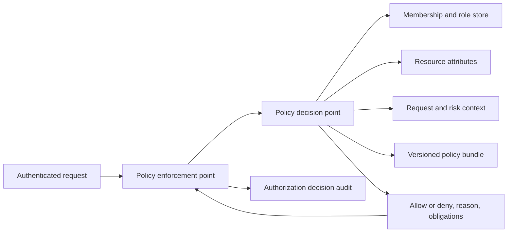

# Authorization Architecture

## Decision

Zorfly uses organization-scoped RBAC with resource and context attributes at
decision time. Zorfly owns sessions and authorization; authentication
federation is delegated through standards-based adapters.

This avoids encoding product authorization in identity-provider groups while
still allowing enterprise administrators to map directory groups to baseline
roles.

## Core model

- **Principal:** authenticated user, service workload, support operator, or
  delegated agent.
- **Organization:** tenant boundary in which membership is evaluated.
- **Membership:** relation between a user and organization, with status and
  lifecycle metadata.
- **Role:** organization-scoped or system-defined collection of permission IDs.
- **Permission:** stable `resource:action` capability, such as
  `document:read`.
- **Assignment:** relation granting a role to a membership within an
  organization.
- **Resource:** object with tenant, owner, classification, and lifecycle
  attributes.
- **Context:** request, device, region, authentication assurance, support case,
  agent run, and time attributes.
- **Policy decision:** allow or deny plus a stable reason code and obligations.

Permissions are additive, but explicit platform safety constraints always deny.
There are no per-user grants in the baseline; exceptions require time-bounded,
audited assignments or an ADR.

## Decision flow

- Policy Enforcement Points exist at API entry, domain commands, tool execution,
  object storage signing, and administrative operations.
- The Policy Decision Point is a shared application capability, not a network
  microservice initially.
- Authorization is evaluated against the resource's authoritative tenant, not a
  client-supplied tenant identifier.
- Database RLS is defense in depth and does not replace application
  authorization.
- Frontend permission checks improve usability only.

## Role design

Start with a small role catalog derived from real job functions. Avoid a
role-per-screen or role-per-customer design.

Each role has:

- immutable ID and stable slug;
- tenant or platform scope;
- version;
- permission set;
- assignment eligibility;
- risk classification;
- owner and review schedule;
- deprecation state.

Role changes create a new version and an audit event. Active sessions must not
retain removed high-risk privileges beyond the approved propagation window.

## Separation of duty

Support static and dynamic separation of duty for sensitive workflows:

- incompatible roles cannot be assigned to one membership;
- a user cannot approve their own high-risk action;
- support impersonation cannot modify identity, billing, or audit controls;
- break-glass access requires strong authentication, justification, expiry,
  notification, and retrospective review;
- agent approval must be performed by an authorized human distinct from the
  agent identity.

## Enterprise directory integration

Directory and SSO groups from an approved identity adapter may map to Zorfly
roles. Zorfly remains the source of truth for:

- permission definitions;
- role versions and risk;
- separation-of-duty constraints;
- resource-level and context-aware decisions;
- audit and revocation.

Provisioning is idempotent. Deprovisioning disables access promptly even when a
downstream cleanup task fails.

## Service and agent identities

Workloads use dedicated short-lived service identities. They never impersonate
human users implicitly.

AI agents receive a delegated authority envelope containing:

- initiating principal and tenant;
- allowed tool IDs and permission subset;
- resource scope;
- maximum cost, duration, turns, and side effects;
- approval requirements;
- expiry and revocation handle.

The agent may request an action, but the tool executor re-authorizes the action
against current policy immediately before execution. Prompt text never grants
authority.

## Caching and revocation

- Cache computed decisions only for low-risk reads and short TTLs.
- Keys include tenant, principal, role/policy version, resource scope, action,
  and relevant context.
- High-risk writes and administrative actions are evaluated live.
- Membership, role, policy, or risk changes publish invalidation events.
- Deny on missing, stale, or ambiguous authorization context.

## Audit

Record:

- decision ID and timestamp;
- tenant and privacy-safe principal identifiers;
- action, resource type, and opaque resource ID;
- policy and role versions;
- allow/deny result and stable reason code;
- required and satisfied obligations;
- support case or agent-run ID where applicable.

Do not log tokens, credentials, raw policy inputs containing sensitive data, or
full resource bodies.

## Required tests

- permission matrix tests for every public command;
- cross-tenant negative tests;
- stale membership and revoked role tests;
- role-version propagation tests;
- separation-of-duty tests;
- support and break-glass expiry tests;
- agent delegated-authority and approval tests;
- property-based tests proving no unknown action defaults to allow.
