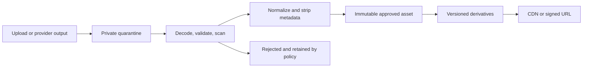
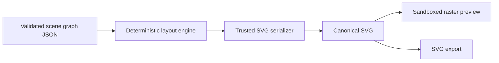

# Media and SVG Architecture

## Goals

The media platform must support user uploads, AI-generated raster images, image
editing, deterministic SVG rendering, previews, transformations, provenance, and
safe delivery without allowing media content to become an execution boundary.

## Asset model

Every asset has:

- immutable Zorfly asset ID and tenant ID;
- owner and authorization scope;
- media class and declared purpose;
- source, parent assets, and transformation lineage;
- original and normalized content hashes;
- detected MIME type, dimensions, size, and encoding;
- storage region, bucket, key, and encryption key;
- quarantine, scan, moderation, and review status;
- generator/provider, model snapshot, prompt-template version, and request ID
  when AI-generated;
- retention, legal hold, deletion, and publication state.

Binary content lives in S3-compatible object storage. PostgreSQL stores metadata
and state, not large blobs.

## Storage zones

- Buckets block public access and use KMS encryption.
- Object keys contain opaque tenant and asset IDs, not customer names.
- Quarantine objects are inaccessible to end users.
- Approved originals are immutable; edits create new asset versions.
- Derivatives include content hash and transformation version.
- Lifecycle rules move cold assets and delete expired quarantine objects.
- Signed upload and download URLs are short-lived and constrained by operation.

## Upload controls

- Detect media type from decoded content; never trust filename or request header.
- Enforce allowlisted formats, dimensions, pixel count, file size, page/frame
  count, and decompression ratios.
- Decode in a sandbox with CPU, memory, time, and output limits.
- Scan for malware and active content.
- Strip unnecessary metadata, including location and device information.
- Re-encode formats when safe to remove ambiguous or polyglot content.
- Use checksum conditions and idempotency for upload completion.
- Serve untrusted downloads as attachments until approved for inline display.

## AI-generated raster images

Raster generation follows `AI_AND_AGENT_ARCHITECTURE.md`.

- Provider output is never delivered directly to a client.
- Persist source inputs by reference and policy, not by copying secrets into
  prompts.
- Validate that returned bytes match the expected format and constraints.
- Apply content-safety and product-policy checks before publication.
- Retain lineage so edits and derivatives can be traced to their sources.
- Store requested and actual dimensions, output format, quality, and background.
- Enforce tenant image quotas, concurrency, and spend budgets before dispatch.
- Use dedicated queue capacity so image workloads cannot starve critical jobs.

## SVG decision

SVG is an active document format, not merely an image. Raw user- or
model-supplied SVG must never be inserted into the DOM or served inline from the
primary application origin.

Zorfly's trusted SVG output is generated from a constrained, versioned scene
graph:

The scene graph supports an allowlisted subset of:

- groups, paths, shapes, text, images, masks, and transforms;
- numeric dimensions and bounded coordinates;
- design-token references;
- embedded or approved same-tenant asset references;
- explicit font families from an approved catalog.

It does not support arbitrary XML, script, `foreignObject`, event handlers,
external stylesheets, remote URLs, unrestricted data URLs, animation, or
provider-defined extensions.

## SVG ingestion

If SVG import is introduced:

1. Parse with DTD and external entities disabled.
2. Reject malformed XML, excessive depth, excessive elements, huge path data,
   unsafe compression, and unsupported namespaces.
3. Remove scripts, event attributes, `foreignObject`, external references,
   unsafe CSS, animation, filters outside policy, and unknown elements.
4. Resolve approved embedded assets to immutable same-tenant references.
5. Convert to the internal scene graph; do not preserve arbitrary source markup
   as trusted output.
6. Serialize canonically with the trusted renderer.
7. rasterize in a network-disabled sandbox and compare expected bounds.
8. record sanitizer and renderer versions with the asset.

Sanitization is allowlist-based. A sanitizer update causes untrusted imports to
be reprocessed before republishing.

## Browser delivery

- Prefer raster derivatives for previews.
- Trusted SVG is served from an isolated media origin with restrictive Content
  Security Policy, `nosniff`, and correct content type.
- Untrusted or legacy SVG is attachment-only.
- The application never uses unsanitized SVG with `innerHTML`.
- Cross-origin credentials are disabled for media delivery.
- User-controlled filenames appear only in download disposition, after encoding.

## Determinism and portability

- Scene graph and renderer versions are persisted.
- Identical normalized input, fonts, assets, and renderer version produce the
  same canonical SVG.
- Font files are versioned and licensed for server, web, and export use.
- Text layout specifies fallback and missing-glyph behavior.
- Colors use an explicit color-space policy.
- Rendering differences are covered by golden and structural tests with
  intentional review workflows.

## Caching

- Approved immutable assets use content-hashed URLs and long-lived CDN caching.
- Mutable asset metadata uses ETags and short bounded caching.
- Authorization is checked before issuing a private signed URL.
- Cache keys never rely on a signature value alone.
- Revocation prevents new URL issuance; high-risk takedown uses CDN invalidation
  and key/object controls.

## Required tests

- format confusion, polyglot, decompression-bomb, and malformed-file tests;
- SVG script, external entity, `foreignObject`, event, CSS URL, and remote-fetch
  attacks;
- cross-tenant asset reference tests;
- deterministic-render and golden-image tests;
- huge dimensions, paths, filters, fonts, and recursion limits;
- provider output mismatch and corrupt output tests;
- signed URL expiry, method, content length, and scope tests;
- deletion, lineage, legal hold, and cache invalidation tests.
