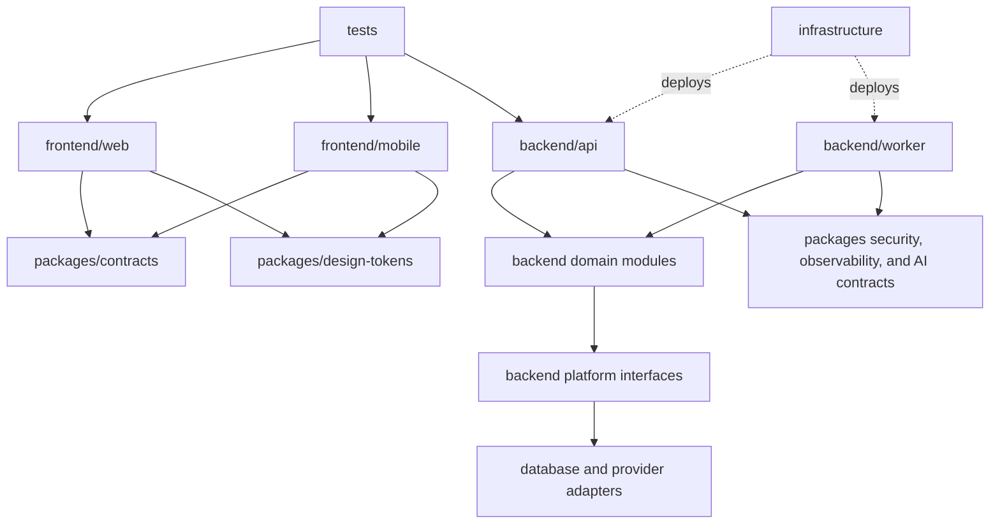

# Project Structure

## Repository model

Zorfly uses a monorepo so contracts, application changes, migrations, tests, and
deployment definitions can evolve atomically. pnpm workspaces and Turborepo will
be introduced during application bootstrap; they are not included in the
foundation phase.

## Current structure

```text
.
├── .github/
│   ├── CODEOWNERS
│   └── PULL_REQUEST_TEMPLATE.md
├── backend/
│   ├── api/
│   └── worker/
├── database/
│   ├── migrations/
│   ├── policies/
│   └── seeds/
├── docker/
│   ├── development/
│   └── production/
├── docs/
│   ├── adr/
│   ├── runbooks/
│   ├── threat-models/
│   └── *.md
├── frontend/
│   ├── mobile/
│   └── web/
├── infrastructure/
│   ├── cdk/
│   ├── environments/
│   └── policies/
├── packages/
│   ├── ai-core/
│   ├── contracts/
│   ├── design-tokens/
│   ├── observability/
│   ├── security/
│   └── testing/
├── scripts/
│   ├── ci/
│   ├── development/
│   └── operations/
├── tests/
│   ├── contract/
│   ├── e2e/
│   ├── evals/
│   ├── performance/
│   ├── resilience/
│   └── security/
├── .editorconfig
├── .gitignore
├── CONTRIBUTING.md
├── README.md
└── SECURITY.md
```

Empty implementation directories contain `.gitkeep` files only. No application
code exists.

## Planned structure

The following structure is a target for the bootstrap phase, not a request to
create these files now:

```text
frontend/
├── web/
│   ├── app/
│   ├── components/
│   ├── features/
│   ├── lib/
│   └── tests/
└── mobile/
    ├── app/
    ├── features/
    ├── platform/
    └── tests/

backend/
├── api/
│   └── src/
│       ├── modules/
│       ├── platform/
│       └── main.ts
└── worker/
    └── src/
        ├── consumers/
        ├── modules/
        └── main.ts

packages/
├── contracts/
├── ai-core/
├── design-tokens/
├── observability/
├── security/
└── testing/

infrastructure/
├── cdk/
├── environments/
└── policies/
```

## Directory responsibilities

### `docs/`

Human-readable architecture, engineering policy, runbooks, threat models, and
ADRs. Documentation changes are reviewed with the code or infrastructure they
describe.

### `frontend/`

Independent web and mobile clients. They may depend on public contracts,
platform-neutral design tokens, and client-safe utilities. They must not depend
on backend implementations, ORM models, cloud SDKs, or server-only packages.
Web and mobile share semantics and tokens, not UI components by default.

### `backend/`

Synchronous API and asynchronous worker deployables. Domain modules may be
shared between these deployables inside server-only workspace packages created
when implementation begins, but no backend implementation can become a client
dependency.

### `packages/`

Deliberately small, platform-neutral contracts and cross-cutting interfaces:

- `contracts`: OpenAPI/event-derived public types without runtime business logic;
- `ai-core`: provider-neutral AI request, usage, tool, and policy contracts;
- `design-tokens`: colors, typography, spacing, and semantic tokens;
- `observability`: telemetry contracts and safe field definitions;
- `security`: authentication/authorization contracts, not policy bypasses;
- `testing`: shared harnesses and deterministic fixtures.

This directory is not a home for generic helpers or domain ownership.

### `infrastructure/`

AWS CDK, environment topology, and policy-as-code. Environment files contain
topology and identifiers only, never secrets. Infrastructure changes follow the
same review, test, promotion, and rollback controls as application changes.

### `database/`

Schema definitions, migrations, seed definitions, database policies, and
database-specific tests. Production data and database dumps are never committed.

### `tests/`

Tests that cross deployable-unit boundaries: end-to-end, contract, performance,
resilience, and tenant-isolation suites. Unit and component tests live beside the
code they verify.

### `.github/`

Repository governance, pull request templates, issue templates, dependency
automation, and CI/CD workflows.

### `docker/`

Container build definitions and local development composition. Images are
minimal, non-root, reproducible, scanned, and separated into build and runtime
stages.

### `scripts/`

Portable, documented automation for development, CI, and operations. Scripts
must be non-interactive by default in CI, fail safely, and avoid hidden
environment assumptions.

## Dependency rules



- Domain modules do not import web, controller, ORM, cloud SDK, or framework
  implementations.
- Modules do not access another module's tables or repository implementation.
- Shared packages contain stable cross-cutting capability, not miscellaneous
  helpers.
- Contracts do not import application implementations.
- Circular package or module dependencies fail CI.
- Infrastructure adapters depend inward on interfaces.
- `packages/ai-core` exposes provider-neutral contracts; OpenAI and Claude SDK
  types remain in backend adapters.
- Mobile and web never import one another.
- Infrastructure does not become a runtime application dependency.

## Ownership

CODEOWNERS begins with the repository owner and must evolve to teams as the
organization grows. Sensitive areas require specialist reviewers:

- identity and security;
- database schema and migrations;
- infrastructure and deployment;
- public API and event contracts;
- AI prompts, tools, provider policy, evaluations, and generated-media pipelines;
- mobile compatibility and public-client deprecations;
- billing and audit systems when introduced.

## Adding a new module

Before adding a module:

1. define its business capability and owner;
2. document its public commands, queries, and events;
3. identify its data ownership and tenant boundary;
4. define authorization and audit requirements;
5. establish unit, integration, contract, and operational tests;
6. add an ADR if the boundary affects multiple teams or deployable units.

## Extracting a microservice

A module remains in the modular monolith unless evidence demonstrates at least
one strong driver:

- independent scaling or tenant-isolation profile;
- failure containment that cannot be achieved in-process;
- distinct security, compliance, or data-residency boundary;
- stable data ownership and contract;
- independent team ownership and release cadence;
- technology requirement that materially conflicts with the main runtime.

Extraction requires an ADR, service-level objectives, on-call owner, API/event
contract, data migration, failure/degradation model, cost estimate, and rollback
plan. Technical-layer services such as a generic "database service" are
prohibited.

## Generated content

Generated clients, schemas, and documentation must:

- come from a committed source contract;
- be reproducible with one documented command;
- carry a generated-file notice;
- be checked for drift in CI;
- be committed only when consumers cannot generate them reliably during build.
