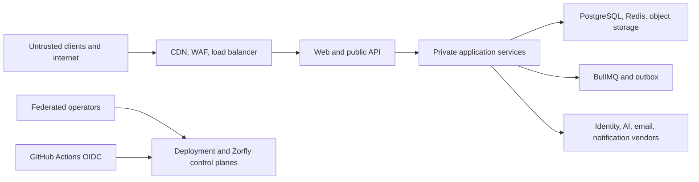

# Security Architecture

## Security objectives

- Preserve confidentiality and isolation of every tenant.
- Protect integrity of business state, authorization, audit, and generated
  assets.
- Keep critical capability available under abuse and dependency failure.
- Make privileged and consequential actions attributable and reviewable.
- Minimize collected data and exposure duration.
- Detect, contain, recover from, and learn from incidents.

## Trust boundaries

Every transition authenticates the caller, validates content, applies
authorization, limits resource use, and emits safe telemetry appropriate to its
risk.

## Identity and sessions

- Zorfly owns local sessions and authorization; standards-based adapters handle
  enterprise SSO, MFA assertions, and directory lifecycle.
- Zorfly validates issuer, audience, signature, nonce/state, expiry, and
  organization membership.
- Browser refresh sessions use opaque, HMAC-hashed, rotated tokens in secure,
  HTTP-only, same-site cookies. Short-lived access tokens remain in browser
  memory and are never written to local storage.
- Mobile uses authorization code with PKCE and secure OS credential storage.
- Session rotation, absolute and idle expiry, revocation, device/risk signals,
  and reauthentication are defined by action risk.
- Workloads use short-lived service identities, not shared API keys.
- Support and break-glass access is time-bounded, approved, visible, and audited.

Authorization is defined in `AUTHORIZATION_ARCHITECTURE.md`.

## Tenant isolation

Isolation is enforced at every layer:

- verified tenant context at API and job entry;
- domain authorization and resource ownership;
- PostgreSQL constraints and forced RLS;
- tenant-scoped storage, cache, queue, AI, cost, and telemetry context;
- per-tenant quotas and noisy-neighbor controls;
- automated cross-tenant negative and load tests;
- a cell/silo path for residency, compliance, or premium isolation.

No caller can select a tenant merely by supplying an identifier.

## Network and egress

- Only edge endpoints are public.
- Application, data, cache, and administrative planes use private subnets where
  supported.
- Security groups permit minimum directional flows.
- Service endpoints reduce public cloud-service egress.
- Outbound HTTP passes through approved adapters with DNS/IP validation, redirect
  limits, SSRF protection, timeouts, size limits, and destination allowlists.
- Provider webhook endpoints are isolated, signature-verified, replay-protected,
  rate-limited, and idempotent.
- Administrative access uses audited federated sessions; no routine SSH.

## Data protection

- Classify data before collection and use.
- Encrypt in transit and at rest with environment-appropriate KMS keys.
- Use field-level protection or tokenization where classification requires it.
- Keep secrets in Secrets Manager and rotate them.
- Separate production from lower environments and prohibit raw production-data
  copies.
- Minimize logs, prompts, tool results, and analytics.
- Enforce retention, legal hold, export, deletion, and backup-expiry policy.
- Use private, signed, short-lived access for customer assets.
- Treat embeddings, generated media, and model conversation state as derived
  customer data.

## Application security

- Strict runtime validation at every trust boundary.
- Parameterized database access and output encoding by context.
- Content Security Policy, secure headers, origin controls, and CSRF defenses.
- Idempotency and replay protection for mutations and webhooks.
- Upload quarantine and deterministic safe-media processing.
- Stable public errors without sensitive internals.
- Bounded request size, complexity, concurrency, and execution time.
- Centralized cryptographic primitives; no custom cryptography.

## AI and agent security

- Prompts and model output never confer authority.
- Tool inputs are schema-validated and tenant/actor context is server-derived.
- Tool execution re-authorizes current policy and requires approval where
  necessary.
- Prompt injection and tool output are treated as hostile content.
- Agent runs have delegated permission, time, turn, token, cost, and side-effect
  budgets.
- Provider routing respects data classification, region, retention, and tenant
  entitlement.
- Raw prompts, outputs, files, and tool results are excluded from logs by
  default.
- Safety policy, evaluation, red teaming, lineage, and emergency kill switches
  gate production use.

## Software supply chain

- Protected branches and required review.
- Pinned lockfiles, toolchains, and reviewed CI actions.
- OIDC instead of stored cloud credentials.
- Secret, dependency, license, SAST, IaC, container, and malware scanning.
- Reproducible builds where practical, SBOMs, provenance, signatures, and
  immutable artifact promotion.
- Minimal non-root runtime images with read-only filesystems where possible.
- Vulnerability triage by exploitability, exposure, and severity with defined
  remediation service levels.

## Administrative and support plane

- Administration uses separate routes, permissions, telemetry, and stronger
  authentication.
- Customer support access requires an active case, reason, scope, expiry, and
  customer-visible evidence where policy requires.
- Impersonation is visually unmistakable and cannot modify identity,
  authorization, billing, or audit controls by default.
- Bulk export, deletion, role change, provider configuration, and security-policy
  changes use step-up authentication and separation of duty.
- Audit records are append-only to application actors and exported to protected
  storage.

## Detection and response

- Central security events cover identity, policy, privilege, data access,
  configuration, WAF, secret, CI/CD, AI tool, media, and support activity.
- Detection rules have owners, severity, runbooks, and test events.
- Incident response defines containment, evidence preservation, communication,
  recovery, and regulatory/customer notification decisions.
- Logs use synchronized time and protected retention.
- Recovery procedures distinguish operational failure, data corruption, and
  compromise; a compromised environment is rebuilt from trusted artifacts.

## Assurance gates

Before production:

- threat models are approved and tracked;
- tenant isolation and authorization denial tests pass;
- penetration testing covers web, API, identity, tenancy, AI tools, uploads, and
  SVG;
- dependency and artifact provenance controls are enforced;
- data retention/deletion and support access are exercised;
- backup restoration and compromise recovery are demonstrated;
- critical/high findings have no unapproved residual risk.

Framework mappings such as SOC 2, ISO 27001, GDPR, HIPAA, or industry-specific
requirements are selected only after product, customer, and legal scope is known.
Architecture supports evidence collection but does not claim compliance.
